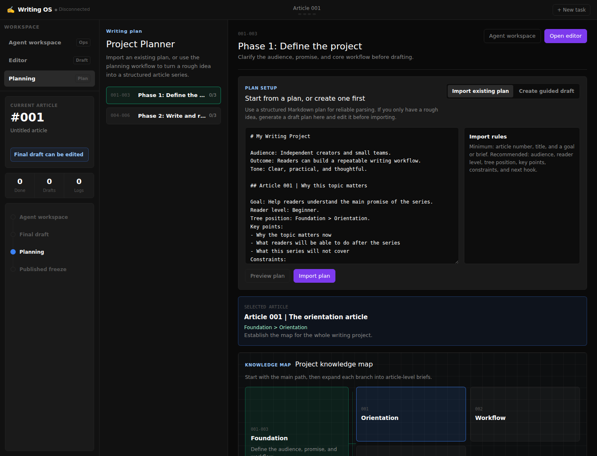

# Writing OS

Writing OS is a local multi-agent writing workspace for planning, drafting, reviewing, and polishing long-form article projects.

It is designed for two kinds of writers:

- Writers who already have a plan and want to import article briefs.
- Writers who only have a rough idea and need guided planning before writing.

The current open-source version runs as a local web app. A desktop wrapper can be added later with Tauri or Electron after the core workflow is stable.



## Features

- Multi-agent writing pipeline: research, structure, writing, final editing.
- Optional specialist agents: reader simulation, fact checking, style, review, growth, distribution.
- Visual agent office showing which agents are working and what each delivered.
- Rich-text final draft editor.
- Published/frozen state so agents stop acting on finalized articles.
- Planning model for importing existing plans or generating a new plan with guidance.
- Optional export integrations, starting with Notion.

## Planning Modes

Writing OS supports two planning paths:

1. Import an existing plan.
   Use `examples/plans/markdown-plan-template.md` as the recommended format.

2. Generate a plan with guidance.
   The planner asks about topic, audience, desired outcome, depth, publishing channel, and approximate length, then creates article-level briefs.

See `docs/planning-model.md` for the full model.

## Quick Start

### Backend

```bash
cd backend
python3 -m venv venv
source venv/bin/activate
pip install -r requirements.txt
cp .env.example .env
# edit .env and add OPENAI_API_KEY
uvicorn main:app --host 0.0.0.0 --port 8000
```

For backend tests:

```bash
cd backend
pip install -r requirements-dev.txt
PYTHONPATH=. pytest -q
```

For a full prepublish check:

```bash
bash scripts/prepublish-check.sh
```

### Frontend

```bash
cd frontend
npm install
export WRITING_OS_BACKEND_URL=http://127.0.0.1:8000
export NEXT_PUBLIC_WRITING_OS_WS_URL=ws://127.0.0.1:8000/ws
npm run dev -- --hostname 0.0.0.0 --port 3000
```

Open `http://localhost:3000`.

To run on alternate ports:

```bash
WRITING_OS_BACKEND_PORT=8100 WRITING_OS_FRONTEND_PORT=3100 bash scripts/start-dev.sh
```

## Configuration

Backend configuration lives in `backend/.env`.

```env
OPENAI_API_KEY=
OPENAI_BASE_URL=https://api.openai.com/v1
OPENAI_MODEL=gpt-4o
```

Optional Notion export:

```env
NOTION_TOKEN=
NOTION_DATABASE_ID=
```

Notion is not required for the core writing workflow. If these values are empty, users can still copy clean publishing text from the editor and manage publishing elsewhere.

## Importing Plans

Create a `plans/` folder at the project root and place one or more Markdown files inside it.

Recommended article format:

```md
## Article 001 | The orientation article

Goal: Establish the map for the whole series.
Reader level: Beginner.
Tree position: Foundation > Orientation.
Key points:
- Explain why the topic matters
- Define the main problem
- Tell readers how the series will progress
Next hook: Move from orientation to the core workflow.
```

Only article number, title, and a brief/goal are required. Richer fields produce better agent output.

## Repository Safety

Do not commit:

- `.env`
- local state under `data/`
- generated build artifacts
- private article drafts
- private planning documents

Optional local forbidden-word checks can be added in `forbidden-patterns.local`. This file is ignored by Git.

## Contributing

See `CONTRIBUTING.md` for local development, test commands, and privacy rules for public contributions.

## Publishing

See `docs/github-publishing.md` for GitHub publishing steps.

For vulnerability reporting and secret-handling guidance, see `SECURITY.md`.

## License

MIT
